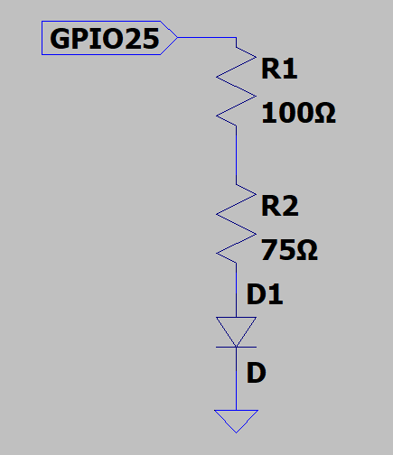
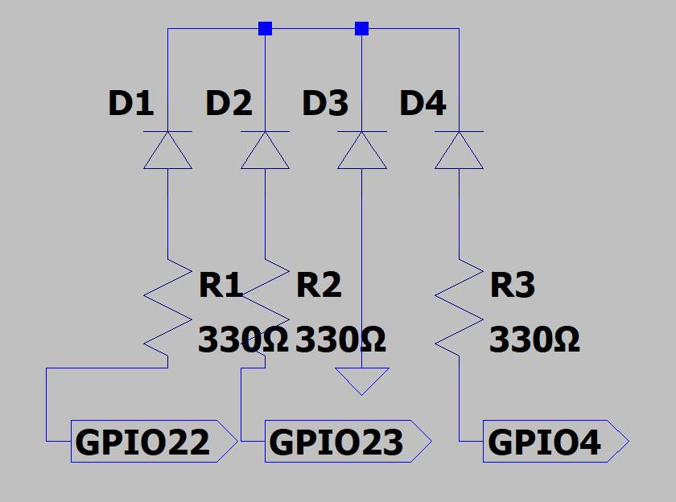
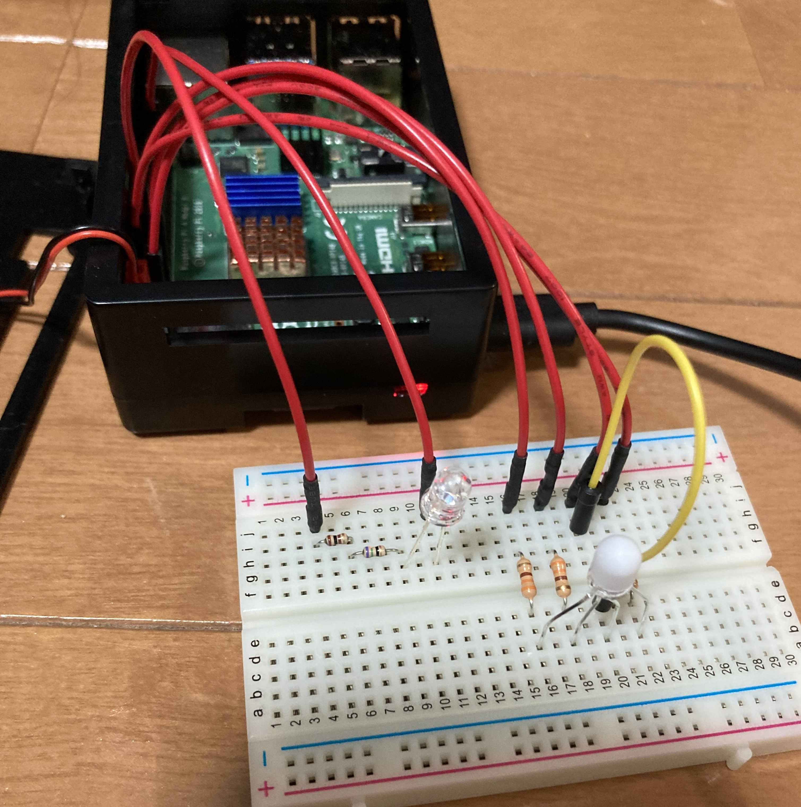

# myled_2020

## フルカラーLEDで信号のピカピカを再現

- フルカラーLEDを使用し，緑色の点滅後に赤色に点灯

## 使用する部品
- Rasberry PI 4 ModelB x1
- RGBフルカラーLED(型番 OSTTA5131A) x1
- 5mm 赤色LED(型番 OSR5CA5B61P) x1
- LED拡散キャップ 5mm白 x1(フルカラーLEDに使用)
- ブレッドボード x1
- ジャンパー線(オス-メス) x1
- ジャンパー線(オス-オス) x6
- カーボン抵抗器 330Ω (フルカラーLEDに使用) x3
- カーボン抵抗器 100Ω(赤色LEDに使用) x1
- カーボン抵抗器 75Ω(赤色LEDに使用) x1

## 回路図
回路図は以下のようになります．

図1　赤色LEDを点灯・点滅させるための回路

図2　フルカラーLEDを点灯・点滅させるための回路

## 配線について
以下の写真のように配線を行った．

図3　配線の様子

5mm 赤色LEDの各ピンとGPIOの接続先
- 赤色LEDのアノードと抵抗(2つの抵抗を直列につなぐ)を接続し，ジャンパー線を用いてGPIO25のピンに接続
- 赤色LEDのカソードと抵抗をジャンパー線を用いてGNDピンに接続

フルカラーLEDの各ピンとGPIOの接続先
- フルカラーLEDの赤ピンと抵抗(330Ω)を接続し，ジャンパー線を用いてGPIO4のピンに接続
- フルカラーLEDの青ピンと抵抗(330Ω)を接続し，ジャンパー線を用いてGPIO22のピンに接続
- フルカラーLEDの緑ピンと抵抗(330Ω)を接続し，ジャンパー線を用いてGPIO23のピンに接続
- フルカラーLEDのカソードピンをジャンパー線を用いてGNDピンに接続

## プログラムの実行方法

'''
$make
$sudo insmod myled.ko
$sudo chmod 666 /dev/myled0
...(作業後)
$sudo rmmod myled
'''

## 動画説明

- フルカラーLEDと5色LEDが交互に点滅する．
$echo 1 > /dev/myled0

- 5mm 赤色LEDが点滅する．
$echo 2 > /dev/myled0

- 信号の緑の点滅後、赤を点灯するイメージで製作した
フルカラーLEDの緑色が点滅し，その後5mm 赤色LEDとともに赤色が点灯する
$echo 3 > /dev/myled0

- フルカラーLEDと5色LEDが消灯する．
$echo 0 > /dev/myled0

- フルカラーLEDを使用し，8色に順に点灯
点灯順は，消灯→赤→緑→黄色→青→ピンク→水色→白
LED拡散キャップを装着することで発光が綺麗に見える．
今回使用するフルカラーLEDは、共通カソードのものであるためGPIOがHighの時に点灯する．
$echo 4 > /dev/myled0

## デモ動画
https://youtu.be/ObT22L09GHY

